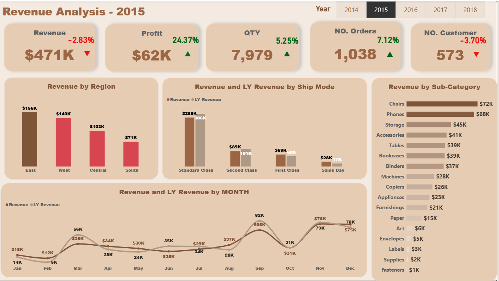
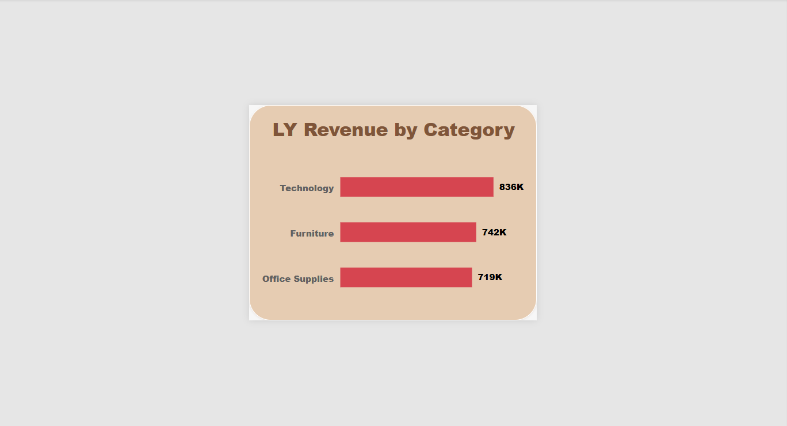
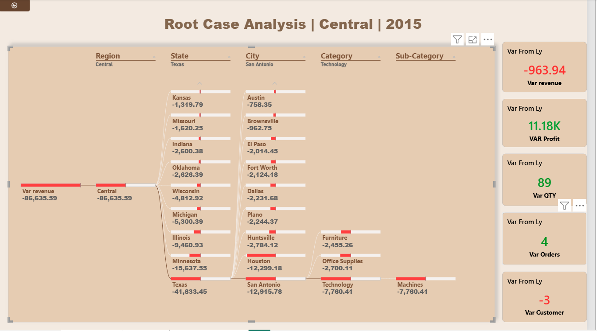

# 📊 Sales Performance Analytics | Power BI


## 📌 Project Overview

This project is an interactive **Power BI Sales Performance Analytics Dashboard** designed to analyze business performance, identify trends, compare Year-over-Year (YoY) results, and investigate the root causes behind revenue changes.

The project goes beyond simply displaying KPIs by applying different types of data analysis to answer three important business questions

> **What happened? → How did performance change? → Why did it happen?**

---

## 🎯 Project Objective

The main objective of this project is to transform raw sales data into meaningful business insights through:

- Interactive Power BI dashboards
- KPI performance tracking
- Year-over-Year analysis
- Trend analysis
- Regional and category analysis
- Root Cause Analysis
- Interactive drill-downs
- Dynamic filtering and tooltips

---

## 🔎 Analysis Approach

### 1️⃣ Descriptive Analysis — What Happened?

The main dashboard provides a high-level overview of business performance through key KPIs and visualizations.

#### Key KPIs — 2015

| KPI | 2015 Performance | YoY Change |
|---|---:|---:|
| 💰 Revenue | $471K | -2.83% |
| 📈 Profit | $62K | +24.37% |
| 📦 Quantity | 7,979 | +5.25% |
| 🧾 Orders | 1,038 | +7.12% |
| 👥 Customers | 573 | -3.70% |

The dashboard also analyzes:

- Revenue by Region
- Revenue by Category
- Revenue by Sub-Category
- Revenue by Ship Mode
- Monthly Revenue
- Previous Year Revenue

---

### 2️⃣ Comparative & Trend Analysis

Year-over-Year (YoY) analysis was used to compare current performance with the previous year and identify positive or negative changes.

**Key observations:**

- Revenue decreased by **2.83%**
- Profit increased by **24.37%**
- Quantity increased by **5.25%**
- Orders increased by **7.12%**
- Customers decreased by **3.70%**

This shows that looking at Revenue alone does not provide the complete business picture. For example:

> **Revenue decreased while Profit increased.**

This difference creates an important business question:

**Why did revenue decrease despite higher profit, quantity, and order volume?**

---

### 3️⃣ Diagnostic Analysis — Root Cause Analysis

To investigate the reasons behind revenue changes, a dedicated **Root Cause Analysis** page was created.

The analysis supports interactive drill-down across:

**Region → State → City → Category → Sub-Category**

This allows users to move from a high-level performance issue to the specific areas contributing to the change.

#### Example — 2015 Central Region

The Central region experienced a revenue variance of approximately:

### **-$86.64K**

The analysis identifies the main contributors to this decline.

**Major State Contributors**

| State | Revenue Variance |
|---|---:|
| Texas | -$41.83K |
| Minnesota | -$15.64K |
| Illinois | -$9.46K |
| Michigan | -$5.30K |
| Wisconsin | -$4.81K |

**Texas** was the largest negative contributor to the Central region's revenue variance.

The drill-down can then continue into cities, categories, and sub-categories to investigate the issue in greater detail.

---

## 💡 Key Insights

- Revenue declined by **2.83%**, while Profit increased by **24.37%**.
- Quantity and Orders increased despite the decline in Revenue.
- Customer count decreased by **3.70%**.
- The Central region showed a significant revenue decline of approximately **$86.64K**.
- **Texas** was the largest negative state contributor with approximately **$41.83K** in revenue variance.
- Root Cause Analysis makes it possible to move from identifying a problem to understanding the factors contributing to it.

---

## 🎛️ Dashboard Features

- 🔹 Dynamic Year Selection
- 🔹 Interactive Filters
- 🔹 Drill-Down Analysis
- 🔹 Custom Tooltips
- 🔹 KPI Cards
- 🔹 YoY Performance Indicators
- 🔹 Root Cause Analysis
- 🔹 Regional Analysis
- 🔹 Category & Sub-Category Analysis
- 🔹 Monthly Trend Analysis

---

## 🛠️ Tools & Technologies

- **Microsoft Power BI**
- **DAX**
- **Power Query**
- **Data Modeling**
- **Data Visualization**
- **Descriptive Analysis**
- **Comparative & Trend Analysis**
- **Diagnostic Analysis**
- **Root Cause Analysis**

---

## 📸 Dashboard Preview

### Main Dashboard


### LY Revenue by Category — Custom Tooltip


### Root Cause Analysis


---

## 📂 Project Structure

```text
Power-BI-Sales-Performance-Analytics/
│
├── 📊 Sales_Performance_Analytics.pbix
│
├── 📸 Screenshots/
│   ├── 01_Main_Dashboard.png
│   ├── 02_LY_Revenue_by_Category.png
│   └── 03_Root_Cause_Analysis.png
│
└── 📄 README.md
```

---

## 📚 Learning Outcomes

Through this project, I gained practical experience in:

- Building interactive Power BI dashboards
- Creating KPI cards and performance indicators
- Writing DAX measures
- Calculating Year-over-Year performance
- Performing trend analysis
- Building data models and relationships
- Using Power Query for data preparation
- Designing interactive drill-down hierarchies
- Creating Custom Tooltips
- Performing Root Cause Analysis
- Analyzing business performance from multiple perspectives
- Turning raw data into meaningful business insights
- Designing dashboards with a focus on usability and storytelling

---

## 🚀 Project Takeaway

This project reinforced an important concept in Data Analytics:

> A good dashboard should not only tell you *what* happened — it should help you understand *why* it happened.

Moving from:

**Descriptive Analysis → Comparative & Trend Analysis → Diagnostic Analysis**

makes the dashboard more than a reporting tool. It becomes a tool for exploring problems, discovering insights, and supporting better business decisions.

---

## 🔮 Future Improvements

Potential improvements for future versions include:

- Adding more advanced customer segmentation
- Creating sales forecasting
- Adding profitability analysis by customer
- Developing automated anomaly detection
- Adding more advanced time-series analysis
- Expanding the Root Cause Analysis with additional business dimensions

---

## 🙏 Acknowledgment

A special thank you to my instructor **Mariam Metwally** for her guidance and support throughout the learning journey.

Many thanks to my mentor **Abdelrahman** for his valuable feedback, support, and guidance throughout the project.

---

## 👨‍💻 Author

**Youssef Mohamed**
Data Analytics & Business Intelligence Enthusiast

⭐ If you find this project useful, feel free to explore the repository and connect with me.

`#PowerBI` `#DataAnalytics` `#BusinessIntelligence` `#DataAnalysis` `#DAX` `#PowerQuery` `#DataVisualization` `#DataModeling` `#DescriptiveAnalysis` `#DiagnosticAnalysis` `#RootCauseAnalysis`
